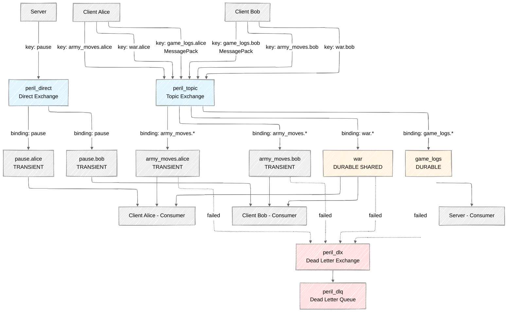

# Peril - Multiplayer Territory Control Game

A multiplayer territory-control game built with RabbitMQ pub/sub messaging architecture. Based on [Boot.dev's Learn Pub/Sub course](https://www.boot.dev/courses/learn-pub-sub-rabbitmq-typescript).

## Table of Contents

- [Prerequisites](#prerequisites)
- [Installation](#installation)
- [RabbitMQ Setup](#rabbitmq-setup)
- [Initial RabbitMQ Configuration](#initial-rabbitmq-configuration)
- [Running the Application](#running-the-application)
- [Client Commands](#client-commands)
- [Server Commands](#server-commands)
- [Quick Game Example](#quick-game-example)
- [Project Structure](#project-structure)
- [Architecture Overview](#architecture-overview)
- [Architecture Diagram](#architecture-diagram)
- [Troubleshooting](#troubleshooting)

---

## Prerequisites

- **Docker** - For running RabbitMQ
- **Node.js** (v20 or higher recommended)
- **npm** - Node package manager

## Installation

1. Clone the repository:

   ```bash
   git clone https://github.com/pderyuga/peril.git
   cd peril
   ```

2. Install dependencies:
   ```bash
   npm install
   ```

---

## RabbitMQ Setup

### Quick Start (Recommended)

Use the provided convenience scripts:

```bash
# Start RabbitMQ in background
npm run rabbit:start

# Stop RabbitMQ
npm run rabbit:stop

# View RabbitMQ logs
npm run rabbit:logs
```

The `rabbit.sh` script manages a Docker container named `peril_rabbitmq` and will:

- Create a new container on first run
- Reuse the existing container on subsequent runs
- Persist your RabbitMQ configuration between runs

**First-Time Setup Notes**:

- Docker will automatically download the RabbitMQ image on first run
- The first `npm run rabbit:start` may take 1-2 minutes while it downloads (~200MB)
- Subsequent runs will be instant

### Manual Docker Setup

If you prefer to run Docker manually:

```bash
docker run -d --name peril_rabbitmq -p 5672:5672 -p 15672:15672 rabbitmq:3.13-management
```

### Access Management UI

Open your browser and navigate to:

- **URL**: http://localhost:15672
- **Username**: `guest`
- **Password**: `guest`

---

## Initial RabbitMQ Configuration

Before running the game, you need to set up exchanges and queues in RabbitMQ. This only needs to be done once (unless you delete the container).

### 1. Create Exchanges

Navigate to the **Exchanges** tab in the Management UI and create the following:

| Name           | Type   | Description                              |
| -------------- | ------ | ---------------------------------------- |
| `peril_direct` | direct | For direct routing (pause/resume)        |
| `peril_topic`  | topic  | For pattern-based routing (moves, war)   |
| `peril_dlx`    | fanout | Dead letter exchange for failed messages |

**Steps**:

1. Go to http://localhost:15672/#/exchanges
2. Click "Add a new exchange"
3. Enter the name and select the type
4. Click "Add exchange"

### 2. Create Queues

Navigate to the **Queues** tab and create:

| Name        | Durability | Description                           |
| ----------- | ---------- | ------------------------------------- |
| `game_logs` | Durable    | Stores game log messages              |
| `peril_dlq` | Durable    | Dead letter queue for failed messages |

**Steps**:

1. Go to http://localhost:15672/#/queues
2. Click "Add a new queue"
3. Enter the name
4. Select "Durable" for durability
5. Click "Add queue"

### 3. Bind Dead Letter Queue

Bind `peril_dlq` to the `peril_dlx` exchange:

1. Click on the `peril_dlq` queue
2. Scroll to the "Bindings" section
3. Under "Add binding to this queue":
   - **From exchange**: `peril_dlx`
   - **Routing key**: (leave empty for fanout)
4. Click "Bind"

### 4. Bind Game Logs Queue

Bind `game_logs` to the `peril_topic` exchange:

1. Click on the `game_logs` queue
2. In the "Bindings" section:
   - **From exchange**: `peril_topic`
   - **Routing key**: `game_logs.*`
3. Click "Bind"

**Note**: Other queues (like pause queues and army movement queues) are created dynamically by the clients when they connect.

---

## Running the Application

### Start RabbitMQ

```bash
npm run rabbit:start
```

Wait a few seconds for RabbitMQ to fully initialize.

### Start the Server

In a new terminal:

```bash
npm run server
```

You should see:

```
Starting Peril server...
Connection to RabbitMQ was successful!
```

**Server Commands**:

- `pause` - Send pause message to all clients
- `resume` - Send resume message to all clients
- `quit` - Exit the server

### Start a Client

In another new terminal:

```bash
npm run client
```

You'll be prompted to enter a username. After connecting, you can use various game commands (see [Client Commands](#client-commands)).

### Running Multiple Servers (Optional)

Use the multiserver script to start multiple server instances:

```bash
./src/scripts/multiserver.sh 3
```

This starts 3 server instances. Press Ctrl+C to stop all instances.

---

## Client Commands

Once connected, use these commands in the client:

### `spawn <location> <unit-type>`

Add a new unit to the map under your control.

**Unit Types**: `infantry`, `cavalry`, `artillery`  
**Locations**: `americas`, `europe`, `africa`, `asia`, `antarctica`, `australia`

**Example**:

```
> spawn europe infantry
Infantry unit spawned with ID: 1
```

### `move <location> <unit-id>`

Move one of your units to a new location. If an opponent has units in that location, war will be declared!

**Example**:

```
> move asia 1
Unit 1 moved to asia
```

### `status`

Display your current game state, including all your units and their locations.

**Example**:

```
> status
Player: alice
Units:
  - ID: 1, Type: infantry, Location: europe
  - ID: 2, Type: cavalry, Location: asia
```

### `help`

Display a list of available commands.

### `quit`

Exit the client and close the connection.

---

## Server Commands

When running the server, you can use these commands:

- **`pause`** - Broadcasts a pause message to all connected clients
- **`resume`** - Broadcasts a resume message to all connected clients
- **`quit`** - Shuts down the server

---

## Quick Game Example

Here's how to run a quick test game with two players:

### Setup

**Terminal 1**: Start RabbitMQ (if not already running)

```bash
npm run rabbit:start
```

**Terminal 2**: Start the server

```bash
npm run server
```

**Terminal 3**: Start Client 1 (Alice)

```bash
npm run client
# Enter username: alice
```

**Terminal 4**: Start Client 2 (Bob)

```bash
npm run client
# Enter username: bob
```

### Gameplay

**Client 1 (Alice)**:

```
> spawn americas infantry
Infantry unit spawned with ID: 1
```

**Client 2 (Bob)**:

```
> spawn europe cavalry
Cavalry unit spawned with ID: 1
```

**Client 1 (Alice)**: Declare war by moving into Bob's territory

```
> move europe 1

==== War Declared ====
Alice has declared war on Bob!
Alice's units:
  * infantry
Bob's units:
  * cavalry
Attacker has a power level of 1
Defender has a power level of 5
Bob has won the war!
You have lost the war!
Your units in europe have been killed.
```

### Unit Power Levels

- **Infantry**: 1 point
- **Cavalry**: 5 points
- **Artillery**: 10 points

The side with the higher total power level wins the war. In a draw, both sides lose all units at that location.

---

## Project Structure

```
peril/
├── src/
│   ├── client/
│   │   └── index.ts              # Client entry point
│   ├── server/
│   │   └── index.ts              # Server entry point
│   ├── internal/
│   │   ├── gamelogic/
│   │   │   ├── gamedata.ts       # Type definitions
│   │   │   ├── gamelogic.ts      # Core game logic
│   │   │   ├── gamestate.ts      # Game state management
│   │   │   ├── logs.ts           # Logging utilities
│   │   │   ├── move.ts           # Move handling
│   │   │   ├── pause.ts          # Pause/resume handling
│   │   │   ├── spawn.ts          # Unit spawning
│   │   │   └── war.ts            # War resolution
│   │   ├── pubsub/
│   │   │   ├── consume.ts        # RabbitMQ consumer utilities
│   │   │   └── publish.ts        # RabbitMQ publisher utilities
│   │   └── routing/
│   │       └── routing.ts        # Routing constants
│   └── scripts/
│       ├── rabbit.sh             # RabbitMQ management script
│       └── multiserver.sh        # Multi-server launcher
├── package.json
├── tsconfig.json
└── README.md
```

---

## Architecture Overview

### Exchanges

- **`peril_direct`** (Direct Exchange)

  - Used for: Pause/resume messages
  - Routing: Exact key matching

- **`peril_topic`** (Topic Exchange)

  - Used for: Army moves, war declarations, game logs
  - Routing: Pattern matching with wildcards
  - Patterns: `army_moves.*`, `war.*`, `game_logs.*`

- **`peril_dlx`** (Fanout - Dead Letter Exchange)
  - Captures failed messages for debugging

### Queue Types

- **Durable Queues**: Survive RabbitMQ restarts (e.g., `game_logs`, `war`)
- **Transient Queues**: Auto-delete when client disconnects (e.g., pause queues, army movement queues)

### Message Flow

1. **Client publishes move** → `peril_topic` exchange with key `army_moves.{username}`
2. **All clients consume moves** → Check for collisions
3. **War detected** → Publish to `peril_topic` with key `war.{username}`
4. **Clients consume war messages** → Resolve combat and update game state
5. **Game logs** → Published to `game_logs.*` for persistence

### Acknowledgement System

Messages can be:

- **Ack**: Successfully processed, remove from queue
- **Nack + Requeue**: Retry processing (e.g., war not resolved yet)
- **Nack + Discard**: Failed permanently, send to dead letter queue

---

## Architecture Diagram

The following diagram illustrates the complete message flow through RabbitMQ exchanges and queues:



### Diagram Legend

| Color     | Component                                             | Description                                            |
| --------- | ----------------------------------------------------- | ------------------------------------------------------ |
| 🔵 Blue   | Exchanges (`peril_direct`, `peril_topic`)             | Main operational exchanges for routing messages        |
| 🟡 Yellow | Durable Queues (`war`, `game_logs`)                   | Persist across RabbitMQ restarts, store important data |
| 🔴 Red    | Dead Letter Infrastructure (`peril_dlx`, `peril_dlq`) | Error handling - captures and stores failed messages   |

**Note**: Transient queues (pause, army_moves) are not highlighted as they auto-delete when clients disconnect.

### Key Points

- **Pause/Resume**: Server publishes to `peril_direct` with exact routing key `pause`. Each client has their own pause queue bound to this key.

- **Army Moves**: Each client publishes moves to `peril_topic` with key `army_moves.{username}`. All clients subscribe with pattern `army_moves.*` to receive all moves.

- **War Declarations**: Published to `peril_topic` with key `war.{username}`. All clients share the same `war` queue (DURABLE) bound with pattern `war.*`, so messages are distributed round-robin.

- **Game Logs**: Clients publish to `peril_topic` with key `game_logs.{username}` using MessagePack encoding. This includes both war outcome logs and spam testing. Server consumes from the `game_logs` queue.

- **Dead Letter**: Failed messages from any queue (with DLX configured) are routed to `peril_dlx` and ultimately to `peril_dlq` for inspection.

---

## Troubleshooting

### RabbitMQ Connection Refused

**Symptom**: `Error: connect ECONNREFUSED 127.0.0.1:5672`

**Solution**:

```bash
npm run rabbit:start
# Wait 5-10 seconds for RabbitMQ to fully start
```

### PRECONDITION_FAILED Error

**Symptom**:

```
Error: Channel closed by server: 406 (PRECONDITION_FAILED) with message
"PRECONDITION_FAILED - inequivalent arg 'x-dead-letter-exchange' for queue..."
```

**Cause**: A queue already exists with different configuration than your code expects.

**Solution**: Delete the problematic queue and restart:

```bash
# Option 1: Via Management UI
# Go to http://localhost:15672/#/queues
# Click on the queue → Delete

# Option 2: Via CLI
docker exec -it peril_rabbitmq rabbitmqctl delete_queue <queue_name>

# Option 3: Purge all queues (nuclear option)
docker stop peril_rabbitmq
docker rm peril_rabbitmq
npm run rabbit:start
# Then reconfigure exchanges/queues
```

### Messages Not Being Received

**Check**:

1. Verify exchange exists and is correct type
2. Verify queue is bound to exchange with correct routing key
3. Check routing key pattern matches (e.g., `war.*` matches `war.alice`)
4. View queue bindings in Management UI

### Purge Messages from Queue

```bash
docker exec -it peril_rabbitmq rabbitmqctl purge_queue <queue_name>
```

### View All Queues

```bash
docker exec -it peril_rabbitmq rabbitmqctl list_queues
```

### Inspect RabbitMQ Logs

```bash
npm run rabbit:logs
# or
docker logs -f peril_rabbitmq
```

### TypeScript Compilation Issues

The project uses `tsx` for direct TypeScript execution, so compilation is not required. However, if you want to build:

```bash
npm run build
```

---

## Development Tips

- **Multiple Terminals**: Use a terminal multiplexer like `tmux` or split terminals in VS Code
- **Management UI**: Keep the RabbitMQ Management UI open to monitor queues in real-time
- **Game Logs Queue**: Check this queue to see all game events
- **Dead Letter Queue**: Check `peril_dlq` if messages are failing unexpectedly

---

## License

This project is for educational purposes as part of Boot.dev's Learn Pub/Sub course.
